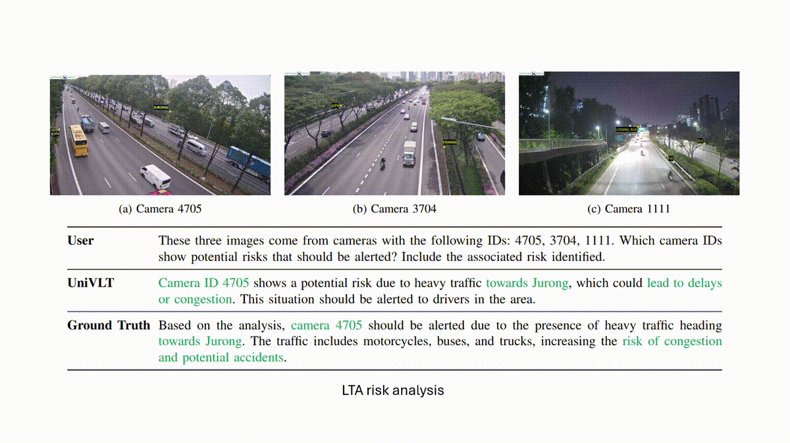
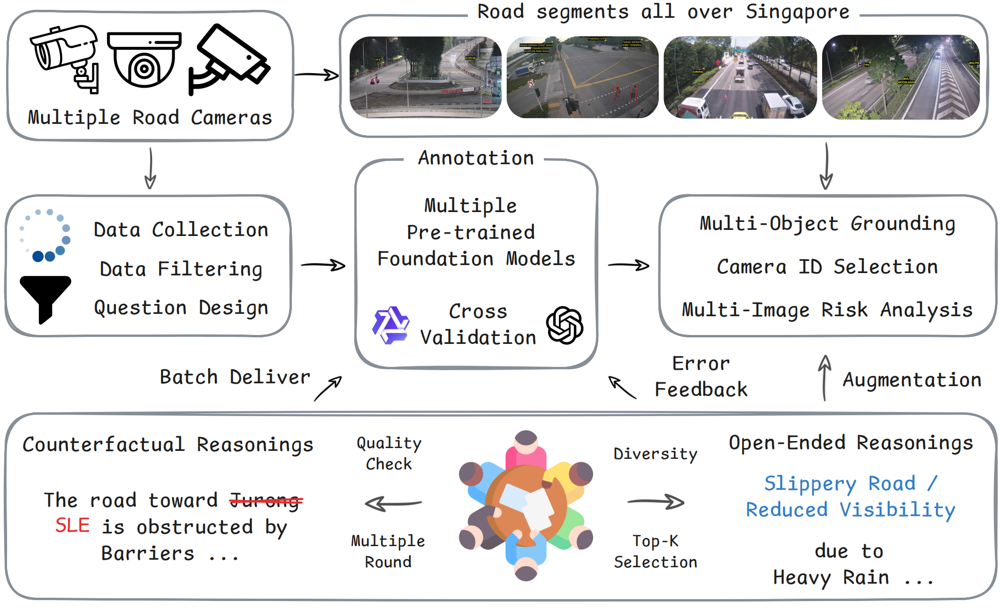

<div align="center">

# Toward Open-Ended City-scale Traffic Dataset and A Unified Vision-Language-Transportation Model (UniVLT)

**Wenhui Huang, Songyan Zhang, Collister Chua, Yang Liang, Zhiqi Mao, Chen Lv\***  
Nanyang Technological University  

\* Corresponding author  

</div>

---
<!-- † -->
<!-- <div align="center">
  
</div>
<div align="center">
  
</div> -->
<div align="center">

| Architecture | Demo |
|--------------|------|
|  |  |

</div>

## 📄 Paper

**arXiv preprint:** (Link will be updated upon release)

If you find our work useful, please consider citing us (see Citation section).

---

## 🔥 Highlights

- 📦 **LTD**: 11.6K high-quality open-ended QA pairs from city-scale roadside cameras  
- 🧠 **UniVLT**: Unified multi-image vision-language transformer  
- 🚦 Multi-view risk reasoning across minimally correlated camera streams  
- 🎯 Joint modeling of grounding, camera identification, and open-ended safety analysis  
- 📊 Strong performance across multimodal perception and safety-critical benchmarks  

---
## 🔨 To-do list:
- [✓] Release training code and dataset.
- [✓] Release evaluation/benchmark code.
- [✓] Release inference code.
- [✓] Release model checkpoint.

# 🧠 UniVLT: Model Overview

UniVLT is a unified multimodal transformer that:

- Interleaves high-resolution visual tokens from multiple cameras
- Operates in a shared vision-language sequence space
- Enables long-range cross-image reasoning
- Uses dynamic visual token budgeting
- Applies parameter-efficient adaptation (LoRA-based fine-tuning)

---

# 🏙️ Land Transportation Dataset (LTD)

LTD is a large-scale open-ended multimodal dataset designed to support robust reasoning in real-world urban traffic environments.

It contains:

- Fine-grained **multi-object grounding**
- Multi-image **camera identification**
- Open-ended **multi-image risk analysis**
- Diverse road geometries, traffic participants, lighting conditions, and weather scenarios

---

## 🛠 Dataset Construction Pipeline

<div align="center">
  
</div>

To ensure annotation fidelity and reduce hallucination:

- Multi-model vision-language generation is first applied  
- Cross-model consistency checking is performed  
- Human-in-the-loop refinement corrects edge cases  
- Systematic validation reduces bias and annotation noise  

---

## 📦 Dataset Access

The LTD dataset is available on Huggingface:

👉 **TO_DO**

LingoQA, Omnidrive and CODA are also available on Huggingface:

👉 **TO_DO**

---

# 📦 Model Zoo

| Model | Backbone | Stage | Link |
|--------|----------|--------|--------|
| UniVLT-7B | Qwen2.5-VL-7B-Instruct | Stage 2 | https://huggingface.co/c-chua/UniVLT |

Backbone model: 
[Qwen2.5-VL-7B-Instruct](https://huggingface.co/Qwen/Qwen2.5-VL-7B-Instruct)

---

# 🚀 Quick Start (Inference)

```
git clone https://github.com/OscarHuangWind/UniVLT.git
cd UniVLT

conda env create -f environment.yml
conda activate UniVLT

pip install -r requirements.txt
pip install ms-swift==3.6.0
pip install flash-attn==2.7.4.post1
```
If flash attention fails:
```
pip install flash-attn
```
Run inference:
```
python univlt_scripts/inference.py \
    --model_id c-chua/UniVLT \
    --eval_data example_lta_risk_id.json \
    --output_path results.json
```

# 🏋️ Training
## Stage 1: Fine-tuning
1. Download Qwen2.5-VL-7B-Instruct backbone.
2. Update:
    - `--model` path
    - `--dataset` paths
    - `WANDB_API_KEY`
    - `output_dir`
3. Run
```
bash training_scripts/LTA_stage1.sh
```
4. Merge LoRA weights:
```
bash test_export.sh /path/to/checkpoint
```
---
## Stage 2: Fine-tuning
1. Set `--model` to Stage 1 merged checkpoint.
2. Update dataset paths.
3. Run:
```
bash training_scripts/LTA_stage2.sh
```
4. Merge final weights:
```
bash test_export.sh /path/to/checkpoint_stage_2
```
---
# 📊 Benchmarking
After inferfence:
```
bash univlt_scripts/eval.sh
```
This computes:
    - NLP metrics
    - Lingo-judge
    - GPT-score

For LTD-specific metrics:
```
python calculate_accuracy.py
python compute_f1_score.py
```

# 📈 Main Results on LTD Benchmark

We compare UniVLT against general-purpose open-source VLMs and autonomous-driving–tailored models on three tasks:

- Multi-Image Risk Analysis (GPT-Score ↑)
- Camera ID Selection (Accuracy ↑)
- Multi-Object Grounding (F1 Score ↑)

| Model | Size | GPT-Score ↑ | Accuracy ↑ | Grounding F1 ↑ |
|--------|------|-------------|------------|----------------|
| LLaVA-OV | 0.5B | 0.01 | 0.29 | 0.00 |
| LLaVA-OV | 7B | 0.03 | 0.32 | 0.00 |
| Qwen2.5-VL | 7B | 0.46 | 0.48 | 0.45 |
| InternVL2.5 | 8B | 0.25 | 0.23 | 0.00 |
| Qwen3-VL | 4B | 0.14 | 0.25 | 0.62 |
| --- | --- | --- | --- | --- |
| OpenEMMA | 3B | 0.10 | 0.29 | 0.44 |
| WiseAD | 1.7B | 0.00 | 0.00 | N/A |
| RoboTron-Drive | 8B | 0.06 | 0.00 | 0.06 |
| ReCogDrive | 8B | 0.29 | 0.32 | N/A |
| --- | --- | --- | --- | --- |
| **UniVLT (Ours)** | **7B** | **0.66** | **0.66** | **0.64** |

**Grounding evaluation protocol.**  
We report grounding results only for models that produce normalized bounding box coordinates or whose outputs can be converted to a thousandth-level normalized scale.

# 🔍 Reproducibility
- All experiments conducted with fixed random seeds.
- LoRA weights merged before final evaluation.
- Offical release tagged as `v1.0`

# ⚖️ Ethics & Data Usage
- Dataset collected from city-scale roadside camera deployments.
- Released for academic research purposes. 
Users are responsible for complying with local regulations and ethical standards.

# 📜 License

Code and dataset is released under the MIT License.

# ✏️ Acknowledgements
This project builds upon:
- [ms-swift](https://github.com/modelscope/ms-swift)
- Qwen2.5-VL

# 📚 Citation
```
@article{huang2026univlt,
  title={Toward Open-Ended City-scale Traffic Dataset and A Unified Vision-Language-Transportation Model},
  author={Huang, Wenhui and Zhang, Songyan and Chua, Collister and Liang, Yang and Mao, Zhiqi and Lv, Chen},
  journal={arXiv preprint arXiv:XXXX.XXXXX},
  year={2026}
}
```